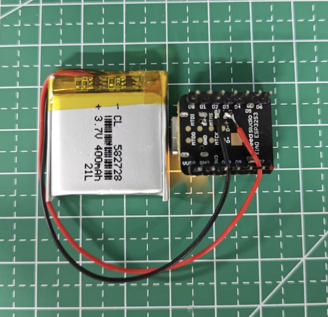

# ESP32 Voice Recorder Integration

This guide explains how to implement voice recording functionality on ESP32 microcontrollers to work with the AI Voice Recorder system.

**Author:** zwanderer  
**Hardware:** ESP32 + I2S Microphone  
**Communication:** WiFi WebSocket

## 🎯 Overview

The ESP32 integration allows for:
- Remote audio capture using I2S microphones
- Real-time audio streaming to the main application
- Low-power voice activity detection
- Wireless deployment in various environments



## 🛠 Hardware Requirements

### Core Components

1. **ESP32 Development Board**
   - ESP32-WROOM-32D/32U (recommended)
   - ESP32-S3 (for advanced features)
   - Minimum 4MB flash memory

2. **I2S Microphone Module**
   - INMP441 (recommended for high quality)
   - MAX9814 (alternative with AGC)
   - SPH0645 (alternative option)

3. **Optional Components**
   - Speaker for audio feedback
   - LED indicators for status
   - External antenna for better WiFi range
   - Battery pack for portable operation

### Wiring Diagram

```
ESP32 Pin    <->    INMP441 Pin    <->    Function
=========    ===    ===========    ===    ========
GPIO22       <->    SCK           <->    Serial Clock
GPIO23       <->    WS            <->    Word Select (LRCLK)
GPIO21       <->    SD            <->    Serial Data
3.3V         <->    VCC           <->    Power
GND          <->    GND           <->    Ground
GND          <->    L/R           <->    Channel Select (GND = Left)

Optional Connections:
GPIO2        <->    LED           <->    Status Indicator
GPIO0        <->    Button        <->    Manual Trigger
```

## 💻 Software Implementation

### 1. Arduino IDE Setup

```bash
# Install ESP32 board package
# In Arduino IDE:
# File -> Preferences -> Additional Board Manager URLs:
https://dl.espressif.com/dl/package_esp32_index.json

# Install required libraries:
# - ESP32 I2S Library
# - ArduinoWebSockets
# - ArduinoJson
# - WiFiManager (optional)
```

### 2. ESP32 Firmware Code

Create `esp32_voice_recorder.ino`:

```cpp
/*
 * ESP32 Voice Recorder - zwanderer
 * 
 * Captures audio via I2S microphone and streams to AI Voice Recorder
 * Features: WebSocket streaming, VAD integration, status indicators
 */

#include <WiFi.h>
#include <WebSocketsClient.h>
#include <ArduinoJson.h>
#include <driver/i2s.h>

// WiFi Configuration
const char* ssid = "YOUR_WIFI_SSID";
const char* password = "YOUR_WIFI_PASSWORD";

// Server Configuration
const char* websocket_host = "192.168.1.100";  // Your computer's IP
const int websocket_port = 8080;
const char* websocket_path = "/audio";

// I2S Configuration
#define I2S_WS_PIN 22      // Word Select (LRCLK)
#define I2S_SCK_PIN 23     // Serial Clock (BCLK)
#define I2S_SD_PIN 21      // Serial Data (DIN)
#define I2S_PORT I2S_NUM_0

// Audio Configuration
#define SAMPLE_RATE 16000
#define BITS_PER_SAMPLE 16
#define CHANNELS 1
#define BUFFER_SIZE 1024
#define DMA_BUFFER_COUNT 8
#define DMA_BUFFER_LEN 1024

// Status LED Configuration
#define LED_PIN 2
#define BUTTON_PIN 0

// Global Variables
WebSocketsClient webSocket;
bool isConnected = false;
bool isRecording = false;
int16_t audioBuffer[BUFFER_SIZE];

void setup() {
    Serial.begin(115200);
    
    // Initialize hardware
    setupPins();
    setupI2S();
    
    // Connect to WiFi
    connectWiFi();
    
    // Initialize WebSocket
    setupWebSocket();
    
    Serial.println("ESP32 Voice Recorder initialized");
}

void loop() {
    webSocket.loop();
    
    if (isConnected) {
        captureAndTransmitAudio();
    }
    
    // Handle button press for manual recording toggle
    if (digitalRead(BUTTON_PIN) == LOW) {
        toggleRecording();
        delay(200); // Debounce
    }
    
    delay(10);
}

void setupPins() {
    pinMode(LED_PIN, OUTPUT);
    pinMode(BUTTON_PIN, INPUT_PULLUP);
    
    // Initial LED state
    digitalWrite(LED_PIN, LOW);
}

void setupI2S() {
    i2s_config_t i2s_config = {
        .mode = i2s_mode_t(I2S_MODE_MASTER | I2S_MODE_RX),
        .sample_rate = SAMPLE_RATE,
        .bits_per_sample = i2s_bits_per_sample_t(BITS_PER_SAMPLE),
        .channel_format = I2S_CHANNEL_FMT_ONLY_LEFT,
        .communication_format = i2s_comm_format_t(I2S_COMM_FORMAT_STAND_I2S),
        .intr_alloc_flags = ESP_INTR_FLAG_LEVEL1,
        .dma_buf_count = DMA_BUFFER_COUNT,
        .dma_buf_len = DMA_BUFFER_LEN,
        .use_apll = false,
        .tx_desc_auto_clear = false,
        .fixed_mclk = 0
    };
    
    i2s_pin_config_t pin_config = {
        .bck_io_num = I2S_SCK_PIN,
        .ws_io_num = I2S_WS_PIN,
        .data_out_num = I2S_PIN_NO_CHANGE,
        .data_in_num = I2S_SD_PIN
    };
    
    esp_err_t result = i2s_driver_install(I2S_PORT, &i2s_config, 0, NULL);
    if (result != ESP_OK) {
        Serial.printf("Failed to install I2S driver: %d\\n", result);
        return;
    }
    
    result = i2s_set_pin(I2S_PORT, &pin_config);
    if (result != ESP_OK) {
        Serial.printf("Failed to set I2S pins: %d\\n", result);
        return;
    }
    
    Serial.println("I2S initialized successfully");
}

void connectWiFi() {
    WiFi.begin(ssid, password);
    
    Serial.print("Connecting to WiFi");
    while (WiFi.status() != WL_CONNECTED) {
        delay(500);
        Serial.print(".");
    }
    
    Serial.println();
    Serial.printf("Connected to WiFi: %s\\n", ssid);
    Serial.printf("IP Address: %s\\n", WiFi.localIP().toString().c_str());
    
    // Blink LED to indicate WiFi connection
    for (int i = 0; i < 3; i++) {
        digitalWrite(LED_PIN, HIGH);
        delay(200);
        digitalWrite(LED_PIN, LOW);
        delay(200);
    }
}

void setupWebSocket() {
    webSocket.begin(websocket_host, websocket_port, websocket_path);
    webSocket.onEvent(webSocketEvent);
    webSocket.setReconnectInterval(5000);
    
    Serial.printf("WebSocket connecting to: ws://%s:%d%s\\n", 
                  websocket_host, websocket_port, websocket_path);
}

void webSocketEvent(WStype_t type, uint8_t * payload, size_t length) {
    switch(type) {
        case WStype_DISCONNECTED:
            Serial.println("WebSocket Disconnected");
            isConnected = false;
            digitalWrite(LED_PIN, LOW);
            break;
            
        case WStype_CONNECTED:
            Serial.printf("WebSocket Connected to: %s\\n", payload);
            isConnected = true;
            digitalWrite(LED_PIN, HIGH);
            
            // Send initial configuration
            sendConfiguration();
            break;
            
        case WStype_TEXT:
            handleTextMessage((char*)payload);
            break;
            
        case WStype_BIN:
            Serial.printf("Received binary data: %u bytes\\n", length);
            break;
            
        case WStype_ERROR:
            Serial.printf("WebSocket Error: %s\\n", payload);
            break;
            
        default:
            break;
    }
}

void sendConfiguration() {
    DynamicJsonDocument doc(1024);
    doc["type"] = "config";
    doc["device"] = "ESP32";
    doc["sample_rate"] = SAMPLE_RATE;
    doc["channels"] = CHANNELS;
    doc["bits_per_sample"] = BITS_PER_SAMPLE;
    doc["author"] = "zwanderer";
    
    String message;
    serializeJson(doc, message);
    webSocket.sendTXT(message);
    
    Serial.println("Configuration sent to server");
}

void handleTextMessage(const char* message) {
    DynamicJsonDocument doc(1024);
    deserializeJson(doc, message);
    
    String type = doc["type"];
    
    if (type == "start_recording") {
        isRecording = true;
        Serial.println("Recording started by server command");
    } else if (type == "stop_recording") {
        isRecording = false;
        Serial.println("Recording stopped by server command");
    } else if (type == "status_request") {
        sendStatus();
    }
}

void toggleRecording() {
    isRecording = !isRecording;
    Serial.printf("Recording %s by button press\\n", isRecording ? "started" : "stopped");
    
    // Send status to server
    DynamicJsonDocument doc(256);
    doc["type"] = "recording_status";
    doc["recording"] = isRecording;
    doc["trigger"] = "button";
    
    String message;
    serializeJson(doc, message);
    webSocket.sendTXT(message);
}

void sendStatus() {
    DynamicJsonDocument doc(512);
    doc["type"] = "status";
    doc["connected"] = isConnected;
    doc["recording"] = isRecording;
    doc["wifi_rssi"] = WiFi.RSSI();
    doc["free_heap"] = ESP.getFreeHeap();
    doc["uptime"] = millis();
    
    String message;
    serializeJson(doc, message);
    webSocket.sendTXT(message);
}

void captureAndTransmitAudio() {
    size_t bytesRead = 0;
    
    esp_err_t result = i2s_read(I2S_PORT, audioBuffer, 
                               sizeof(audioBuffer), &bytesRead, portMAX_DELAY);
    
    if (result == ESP_OK && bytesRead > 0) {
        // Simple VAD: check if audio level is above threshold
        bool hasAudio = checkAudioLevel(audioBuffer, bytesRead / sizeof(int16_t));
        
        if (hasAudio || isRecording) {
            // Send audio data via WebSocket
            webSocket.sendBIN((uint8_t*)audioBuffer, bytesRead);
            
            // Blink LED during transmission
            digitalWrite(LED_PIN, !digitalRead(LED_PIN));
        }
    }
}

bool checkAudioLevel(int16_t* buffer, size_t samples) {
    const int16_t threshold = 500; // Adjust based on environment
    long sum = 0;
    
    for (size_t i = 0; i < samples; i++) {
        sum += abs(buffer[i]);
    }
    
    int16_t average = sum / samples;
    return average > threshold;
}

// Error handling and recovery
void handleError(const char* error) {
    Serial.printf("Error: %s\\n", error);
    
    // Flash LED rapidly to indicate error
    for (int i = 0; i < 10; i++) {
        digitalWrite(LED_PIN, HIGH);
        delay(100);
        digitalWrite(LED_PIN, LOW);
        delay(100);
    }
    
    // Attempt recovery
    ESP.restart();
}
```

### 3. Server-Side WebSocket Handler

Add to your main Python application:

```python
# esp32_integration.py - Add to your voice recorder project

import asyncio
import websockets
import json
import wave
import threading
from datetime import datetime

class ESP32AudioServer:
    def __init__(self, host="0.0.0.0", port=8080):
        self.host = host
        self.port = port
        self.clients = set()
        self.audio_buffer = []
        
    async def register_client(self, websocket):
        self.clients.add(websocket)
        print(f"ESP32 client connected: {websocket.remote_address}")
        
    async def unregister_client(self, websocket):
        self.clients.discard(websocket)
        print(f"ESP32 client disconnected")
        
    async def handle_client(self, websocket, path):
        await self.register_client(websocket)
        try:
            async for message in websocket:
                if isinstance(message, str):
                    # Handle JSON commands
                    await self.handle_text_message(websocket, message)
                else:
                    # Handle binary audio data
                    await self.handle_audio_data(websocket, message)
        except websockets.exceptions.ConnectionClosed:
            pass
        finally:
            await self.unregister_client(websocket)
    
    async def handle_text_message(self, websocket, message):
        try:
            data = json.loads(message)
            msg_type = data.get("type")
            
            if msg_type == "config":
                print(f"ESP32 Config: {data}")
            elif msg_type == "status":
                print(f"ESP32 Status: {data}")
                
        except json.JSONDecodeError:
            print(f"Invalid JSON received: {message}")
    
    async def handle_audio_data(self, websocket, audio_data):
        # Process audio data from ESP32
        self.audio_buffer.extend(audio_data)
        
        # Save to file when buffer is large enough
        if len(self.audio_buffer) > 32000:  # ~2 seconds at 16kHz
            self.save_audio_chunk()
    
    def save_audio_chunk(self):
        timestamp = datetime.now().strftime("%Y%m%d_%H%M%S")
        filename = f"recordings/esp32_audio_{timestamp}.wav"
        
        with wave.open(filename, 'wb') as wf:
            wf.setnchannels(1)
            wf.setsampwidth(2)  # 16-bit
            wf.setframerate(16000)
            wf.writeframes(bytes(self.audio_buffer))
        
        print(f"Saved ESP32 audio: {filename}")
        self.audio_buffer = []
    
    def start_server(self):
        return websockets.serve(self.handle_client, self.host, self.port)

# Integration with main application
def start_esp32_server():
    server = ESP32AudioServer()
    loop = asyncio.new_event_loop()
    asyncio.set_event_loop(loop)
    
    start_server = server.start_server()
    loop.run_until_complete(start_server)
    loop.run_forever()

# Start in separate thread
esp32_thread = threading.Thread(target=start_esp32_server, daemon=True)
esp32_thread.start()
```

## 🔧 Configuration

### 1. Network Setup

```cpp
// Update WiFi credentials in ESP32 code
const char* ssid = "YOUR_WIFI_SSID";
const char* password = "YOUR_WIFI_PASSWORD";

// Update server IP (your computer's IP address)
const char* websocket_host = "192.168.1.100";
```

### 2. Audio Quality Settings

```cpp
// Higher quality (more bandwidth)
#define SAMPLE_RATE 16000
#define BITS_PER_SAMPLE 16

// Lower quality (less bandwidth)
#define SAMPLE_RATE 8000
#define BITS_PER_SAMPLE 8
```

### 3. Power Optimization

```cpp
// Add to setup() for battery operation
esp_sleep_enable_ext0_wakeup(GPIO_NUM_0, 0); // Wake on button press
esp_wifi_set_ps(WIFI_PS_MIN_MODEM);          // Enable WiFi power saving
```

## 🧪 Testing and Deployment

### 1. Hardware Testing

```bash
# Test I2S microphone
# Upload test sketch and monitor serial output
# Verify audio levels and quality

# Test WiFi connectivity
# Check RSSI values and connection stability

# Test WebSocket communication
# Verify data transmission to server
```

### 2. Performance Optimization

```cpp
// Adjust buffer sizes for your use case
#define DMA_BUFFER_COUNT 8    // Increase for stability
#define DMA_BUFFER_LEN 1024   // Adjust for latency/quality trade-off

// Fine-tune VAD threshold
const int16_t threshold = 500; // Lower = more sensitive
```

### 3. Production Deployment

1. **Enclosure Design**
   - 3D print custom enclosure
   - Ensure microphone placement for optimal pickup
   - Include status LED visibility

2. **Power Management**
   - Use LiPo battery with charging circuit
   - Implement deep sleep for extended operation
   - Add voltage monitoring

3. **Multiple Units**
   - Configure unique device IDs
   - Implement device discovery
   - Load balancing for multiple ESP32s

## 📊 Monitoring and Debugging

### Serial Monitor Output

```
ESP32 Voice Recorder initialized
Connecting to WiFi...
Connected to WiFi: MyNetwork
IP Address: 192.168.1.150
I2S initialized successfully
WebSocket connecting to: ws://192.168.1.100:8080/audio
WebSocket Connected to: ws://192.168.1.100:8080/audio
Configuration sent to server
Recording started by button press
Audio level: 1250 (above threshold)
Audio transmitted: 2048 bytes
```

### Common Issues and Solutions

1. **No Audio Capture**
   ```cpp
   // Check I2S configuration
   // Verify microphone wiring
   // Test with known good microphone
   ```

2. **WebSocket Connection Failed**
   ```cpp
   // Verify server IP address
   // Check firewall settings
   // Ensure server is running
   ```

3. **Poor Audio Quality**
   ```cpp
   // Increase sample rate
   // Check for electromagnetic interference
   // Verify power supply stability
   ```

## 🔮 Advanced Features

### 1. On-Device VAD

```cpp
// Implement simple energy-based VAD
bool isVoiceActivity(int16_t* buffer, size_t samples) {
    // Calculate zero-crossing rate
    int zeroCrossings = 0;
    for (size_t i = 1; i < samples; i++) {
        if ((buffer[i-1] >= 0) != (buffer[i] >= 0)) {
            zeroCrossings++;
        }
    }
    
    // Calculate energy
    long energy = 0;
    for (size_t i = 0; i < samples; i++) {
        energy += buffer[i] * buffer[i];
    }
    energy /= samples;
    
    // Voice activity if high energy and moderate zero-crossing rate
    return (energy > 1000000) && (zeroCrossings > 10) && (zeroCrossings < 100);
}
```

### 2. Multiple Microphone Support

```cpp
// Configure multiple I2S channels
#define NUM_MICROPHONES 2
i2s_channel_fmt_t channel_formats[] = {I2S_CHANNEL_FMT_ONLY_LEFT, I2S_CHANNEL_FMT_ONLY_RIGHT};
```

### 3. Edge AI Integration

```cpp
// Add TensorFlow Lite Micro for on-device inference
#include <TensorFlowLite_ESP32.h>

// Implement keyword spotting or basic speech recognition
bool detectWakeWord(int16_t* audio_data) {
    // Run inference on ESP32
    // Return true if wake word detected
}
```

## 📈 Performance Metrics

### Expected Performance

| Metric | Value |
|--------|-------|
| Audio Latency | < 100ms |
| WiFi Range | 30-50m indoor |
| Battery Life | 8-12 hours |
| Memory Usage | < 200KB |
| CPU Usage | < 30% |

### Optimization Tips

1. **Reduce latency:** Smaller DMA buffers
2. **Extend battery:** Enable WiFi power saving
3. **Improve range:** External antenna
4. **Higher quality:** Increase sample rate

---

**Hardware Setup Reference:** See the ESP32 setup image above for proper microphone wiring and component placement.

**Author:** zwanderer  
**License:** MIT